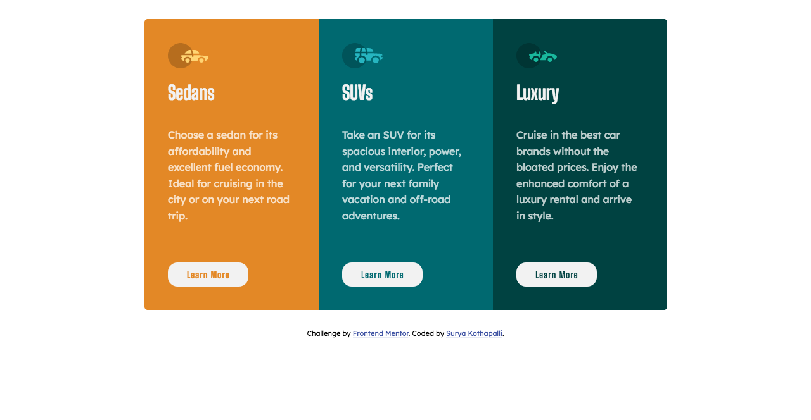

# Frontend Mentor - 3-column preview card component solution

This is a solution to the [3-column preview card component challenge on Frontend Mentor](https://www.frontendmentor.io/challenges/3column-preview-card-component-pH92eAR2-). Frontend Mentor challenges help you improve your coding skills by building realistic projects. 

## Table of contents

- [Overview](#overview)
  - [The challenge](#the-challenge)
  - [Screenshot](#screenshot)
  - [Links](#links)
- [My process](#my-process)
  - [Built with](#built-with)
  - [What I learned](#what-i-learned)
  - [Continued development](#continued-development)
  - [Useful resources](#useful-resources)
- [Author](#author)


## Overview

### The challenge

Users should be able to:

- View the optimal layout depending on their device's screen size
- See hover states for interactive elements

### Screenshot



### Links

- [Solution URL](https://github.com/surya687/frontend-mentor-challenges/tree/3-column-preview-card-component)
- [Live Site URL](https://surya687.github.io/frontend-mentor-challenges)

## My process

### Built with

- Semantic HTML5 markup
- Used BEM methodology, while naming css classes
- CSS custom properties
- Flexbox
- Mobile-first workflow


### What I learned

* Practiced workflow mentioned in the challenge
  1. Initialize your project as a public repository on [GitHub](https://github.com/). Creating a repo will make it easier to share your code with the community if you need help. If you're not sure how to do this, [have a read-through of this Try Git resource](https://try.github.io/).
  
  2. Configure your repository to publish your code to a web address. This will also be useful if you need some help during a challenge as you can share the URL for your project with your repo URL.
  
  3. Look through the designs to start planning out how you'll tackle the project. This step is crucial to help you think ahead for CSS classes to create reusable styles.
  
  4. Before adding any styles, structure your content with HTML(Design the markup for Big screens first as the layout in big screen is complex than that in small screen). Writing your HTML first can help focus your attention on creating well-structured content.
  
  5. Write out the base styles for your project, including general content styles, such as `font-family` and `font-size`.For styling, design first for small screen(i.e mobile first)
  
  6. Start adding styles to the top of the page and work down. Only move on to the next section once you're happy you've completed the area you're working on.

* I have learned and practiced the BEM methodology.
[BEM](https://www.integralist.co.uk/posts/bem/#4) - The Block, Element, Modifier methodology (commonly referred to as BEM) is a popular naming convention for classes in HTML and CSS. Developed by the team at Yandex, its goal is to help developers better understand the relationship between the HTML and CSS in a given project.

  ```
    <div class="card card--suvs ">
    
    <h1 class="card__title">SUVs</h1>
    <p class="card__body">
      ... </p>
    <a class="card__button">Learn More</a>
    </div>

  ```

  ```
  .card-deck{
    ...
  }
  .card__title{
    ...
  }
  .card--sedon{
    ...
  }
  ```

### Useful resources

- [Flex box guide](https://css-tricks.com/snippets/css/a-guide-to-flexbox/) - This helped me for layout.
- [BEM](https://css-tricks.com/bem-101/) - This helped me in naming the css classes in an organised way.

## Author

- Website - [Surya Kothapalli](https://www.your-site.com)
- Frontend Mentor - [@surya687](https://www.frontendmentor.io/profile/yourusername)

